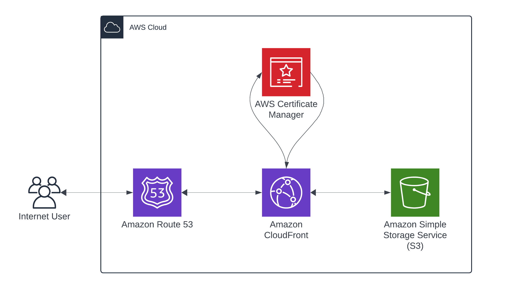

# joshdirkx.com

This repository contains all the code powering my personal website.

## Architecture Overview

### Frontend

The architecture in this frontend application is designed to be simple,
scalable, and secure.

When a user navigates to [joshdirkx.com](https://joshdirkx.com), the request is
first directed to a Domain Name Service (DNS), in this case Amazon Route 53, a
highly scalable and available service that routes requests to the most appropriate
locations to serve the requested content. This could be based on a variety of
factors, including latency, health checks, or geographic location.

When the DNS resolves, Route 53 will direct the request to Amazon
CloudFront, a content delivery network (CDN) service. CloudFront ensures low
latency and high transfer speeds by caching content at the edge, which
significantly speeds up the delivery of content to the user. Learn more about
edge computing [here](https://en.wikipedia.org/wiki/Edge_computing).

The content being served by CloudFront originates in Amazon Simple Storage
Service (S3), an object storage service. S3 hosts the static resources of
the frontend application. When the content in the cache expires, or when the
request is not in the cache, CloudFront fetches the latest content from the
S3 bucket and serves it.

Additionally, this architecture incorporates AWS Certificate Manager (ACM),
a service that lets you easily provision, deploy, and manage public and
private SSL/TLS certificates. This securely encrypts the communication
between the user and CloudFront with an SSL/TLS certificate, preventing
eavesdropping.
